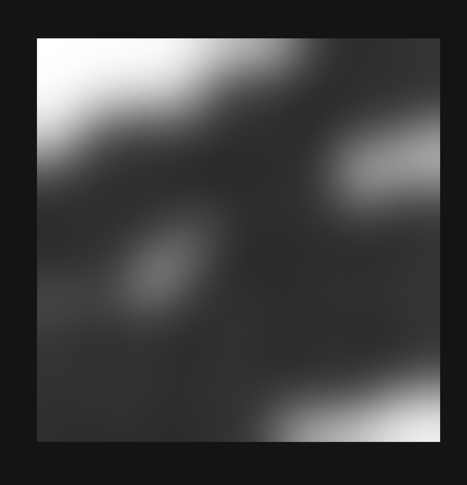

# Noise generator using html5 canvas

Small project to see if I could write some kind of noise generation algorithm from scratch.

The idea was to work from first principles, and try to make something, regardless of how naive, without reading about how actual noise is generated.

This works, though it is very slow.

**You should almost definitely keep your canvas size small. Like, around 200x200 **

## Algorithm

The idea was to create a kind of 'bloom' effect, where random central points are placed and then noise is generated outward from each.

Pseudocode:

```
    // Make anchors
    Generate random anchor points throughout the noise array

    // Bloom out from anchor point
    For each anchor point
        Get its neighbours (top, left, bottom, right)
            For each neighbour
                Generate neighbour's noise value relative to current anchor's noise value
                Make neighbour an anchor itself and add to anchor queue
                Continue
            Loop until no anchor points left

    // Smooth all points
    For each point on screen
        Get its neighbours values
        Compute average of those values
        Set point = average * smoothFactor

    Render all points
                
```

There are some properties that can be used to configure the output

- numAnchors: how many anchors to generate (anchor loop is the bottleneck so higher values will make your browser sad) 
- brightness: controls how bright a bloom will look. lower numbers result in much darker blooms
- smoothN: how many smoothing passes to do - lower values will create harder edges and patterns
- spread: controls bloom spread radius - (this will also make your browser cry)


You can achieve relatively fast generation, with ok output by keeping your num anchors < 90 & your spread < 50.

Then using the brightness and smoothN properties to tweak the output.

Here's an example of some properties that worked well for me:

```
const numAnchors = 70
const smoothN = 500
const brightness = 0.3
const spread = 40
```

## Examples

Here are some maps the algorithm has generated



